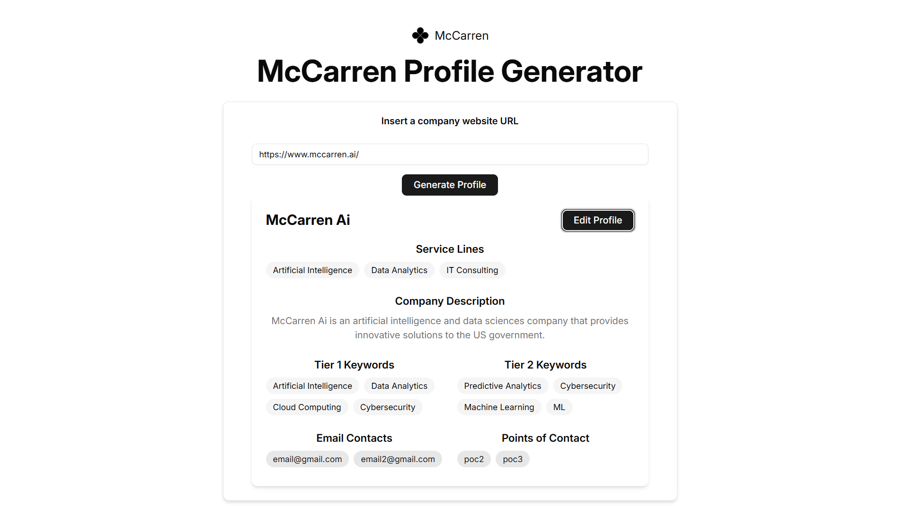

# McCarren DevChallenge

Technical challenge for McCarren



## Technologies

Using Vite, React, and TypeScript.

For the UI components, using shadcn/ui and Tailwind CSS for styling.

The AI Model used is Llama 3 70b and the API is hosted on Groq.

## Deployed application
The application is deployed on Vercel and can be accessed at [https://mccarren-challenge.vercel.app](https://mccarren-challenge.vercel.app).

## Getting Started

Note: Use Node.js version 20 or higher.

1. Clone the repository:
   ```bash
   git clone
   ```
2. Navigate to the project directory:
   ```bash
   cd mccarren-devchallenge
   ```
3. Install the dependencies:
   ```bash
   npm install
   ```
4. Start the development server:
   ```bash
   npm run dev
   ```
5. Open your browser and navigate to `http://localhost:5173` to see the application running.


### Features not implemented
- Fields validation. For example, the email field should be validated to ensure it is in a valid format.
- Better componentization.
- Unit tests.